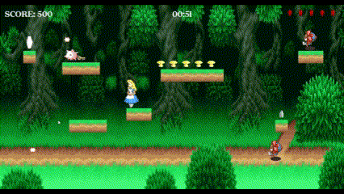
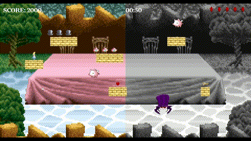
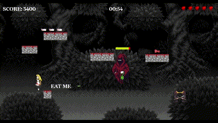

<h1 align="center">Alice in Wonderland</h1>

<h4> Hola! Soy Dianyeli yrigay 👋</h4>
<h4> Estudiante de Programación en la UTN </h4>

Alice in Wonderland es un juego de plataformas inspirado en el cuento de Alicia en el País de las Maravillas, donde nada es lo que parece. Los jugadores asumen el papel de Alice y viven con ella la transformación de su personaje, pasando de ser una niña tierna a una niña trastornada en busca de matar a los demonios que la perturban.

El objetivo principal del juego es ayudar a Alice a encontrar la llave que abrirá el portal para sumergirse a un nuevo mundo, tratando de escapar de sus pesadillas que cada vez son mas perturbadoras.

# Niveles
### Nivel 1: El país de las maravillas

Alice se adentra en el país de las maravillas donde deberás guiarla a buscar la llave que abrirá el portal de salida. Durante esta búsqueda deberás enfrentar a los enemigos y ten cuidado con las trampas! Podrían distorsionar la realidad...

 

### Nivel 2: La hora del Té

Un nuevo desafío espera a Alice y parece que su tamaño no le favorece, deberás ayudarla a escapar de un nuevo enemigo... el sombrerero (¡parece que ha perdido la cabeza!). Y no llegues a mitad del camino, en Alice se despierta una nueva personalidad...

 

### Nivel 3: El bosque maldito

En este nivel deberás acompañar a Alice a enfrentar a sus peores pesadillas, los demonios que perturbaron su país de las maravillas...

 

# Controles
Para controlar a Alice, podremos utilizar las siguientes teclas:

`TECLA →:` Movimiento hacia la derecha.

`TECLA ←:` Movimiento hacia la izquierda.

`TECLA BARRA ESPACIADORA:` Salto (doble barra / doble salto).

`TECLA X:` Disparar.

# Enemigos

### - Flypig:

Estos cerditos voladores no son lo que parece, cuidado con tocarlos que pueden restarte una vida.

### - Flor Mortal:

Que no te engañen! disparan constantemente, deberás esquivar sus proyectiles.

### - EL Sombrerero:

Ha perdido la cabeza y si detecta tus movimientos cerca buscará clavarte los dientes.

### - Cuervo de la Muerte:

Este cuervo es el guardían de nuestro enemigo final, vigila la zona y si detecta movimientos cerca buscará matarte.

### - El demonio de la Muerte:

El Jefe Final. La peor pesadilla de Alice, te perseguirá y buscará matarte, apuntale bien, intentará esquivar tus cuchillazos.

# Consumibles
### - Objetos:
   

Podrás escontrar objetos a lo largo de los niveles que te ayudarán a subir puntos.

### - Vidas:

Aumentarán tus vidas! menor probabilidad a que te maten.

### - Poción de Encogimiento / Tarta Mágica:
 

Ayudarán a que Alice se adapte al tamaño que necesite para continuar los niveles.

### - Keys:
 

Ayudarán a descubrir el portal y poder avanzar al siguiente nivel.

# Cómo perder

- Perdiendo todas las vidas (se van restando al colisionar con un enemigo o al recibir algún disparo)
- Si te quedas sin tiempo en el nivel, cada uno tiene un tiempo de 60 segundos.

Si Alice pierde todas sus vidas o se queda sin tiempo, el juego terminará y se mostrará el menú de juego perdido.

#
<h3 align="center">Alice in Wonderland ha sido desarrollado con Pygame como entrega final para la asignatura Programación 1 de la Universidad Tecnológica Nacional (UTN)</h3>

